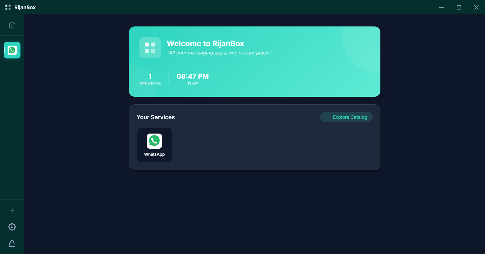
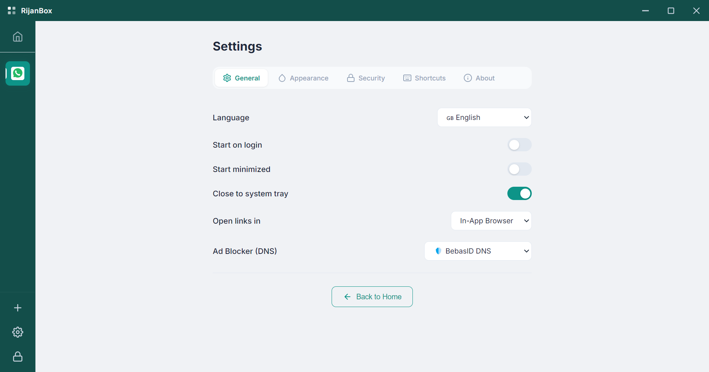

# RijanBox 🚀

<p align="center">
  
  <br>
  <strong>Multi-Messenger Desktop App</strong><br>
  Manage unlimited social media accounts in one secure, lightweight, and elegant desktop app.
</p>

---

## ✨ Features at a Glance

RijanBox is built for productivity and privacy. Here's why you'll love it:

- 🎨 **Elegant Design** — Modern glassmorphism UI with Light and Dark modes.
- 🔐 **Privacy First** — Secure your workspace with PIN protection and auto-lock.
- ♾️ **Unlimited Services** — WhatsApp, Telegram, Discord, and anything with a URL.
- 💤 **Service Hibernation** — Save RAM by sleeping unused services.
- 🎨 **Personalization** — 10 color themes and custom icon support.

---

## 📸 Screenshots

| Homescreen (Light) | Homescreen (Dark) |
|---|---|
|  |  |

| Service Catalog | App Settings |
|---|---|
|  |  |

---

## 📖 Documentation

For full details on how to use RijanBox, check out our comprehensive guides:

- 🇮🇩 [**Dokumentasi Lengkap (Bahasa Indonesia)**](docs/id-docs.md)
- 🇬🇧 [**Complete Documentation (English)**](docs/en-docs.md)

## 🚀 Quick Start

```bash
# Install dependencies
npm install

# Build & Run
npm start

# Development mode
npm run dev

# Package for distribution
npm run dist
```

## 📦 Downloads

Pre-built binaries for Windows, macOS, and Linux are available on the [Releases](https://github.com/Rijanara-Teknologi/RijanBox/releases) page.

| Platform | Format |
|----------|--------|
| Windows | `.exe` (NSIS installer) |
| macOS | `.dmg` |
| Linux | `.AppImage`, `.deb` |

## 🏗️ Tech Stack

- **Electron** — Cross-platform desktop framework
- **TypeScript** — Type-safe main process
- **Vanilla CSS** — Custom design system with light/dark themes
- **electron-store** — Persistent config storage

## ⌨️ Keyboard Shortcuts

| Shortcut | Action |
|----------|--------|
| `Ctrl+1-9` | Switch to service 1–9 |
| `Ctrl+L` | Lock app |
| `Ctrl+,` | Open Settings |
| `Ctrl+N` | Add new service |
| `Ctrl+K` | Search services |
| `Ctrl+M` | Mute/Unmute current service |
| `Ctrl+T` | Toggle sidebar |
| `F11` | Fullscreen |

## 📁 Project Structure

```
rijanbox/
├── src/
│   ├── main/          # Electron main process (TypeScript)
│   ├── preload/       # Secure IPC bridge
│   ├── renderer/      # UI (HTML, CSS, JS)
│   └── data/          # Service catalog & i18n
├── assets/            # App icons
├── .github/workflows/ # CI/CD build pipeline
├── CHANGELOG.md
└── LICENSE
```

## 🔨 Building

Builds are automated via GitHub Actions for all 3 platforms. To trigger a release:

```bash
git tag v1.0.0
git push origin v1.0.0
```

To build locally:

```bash
npm run dist        # Build for current platform
npm run pack        # Package without installer (for testing)
```

## 📄 License

MIT License © 2026 Rijanara
