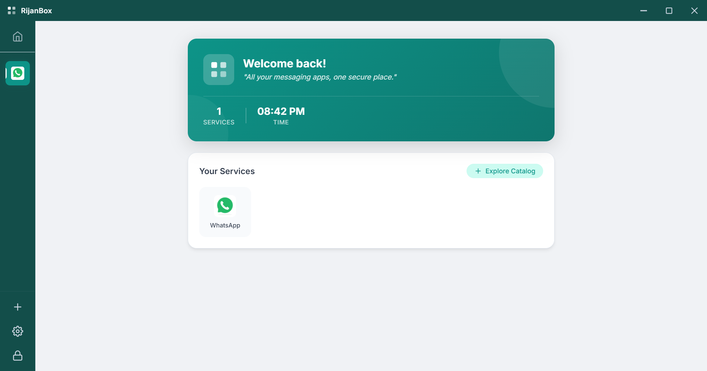
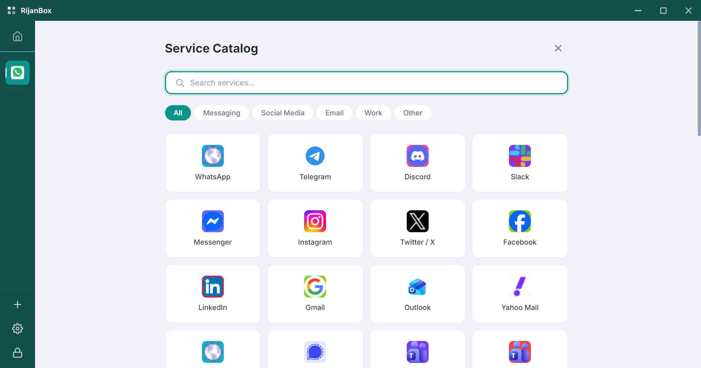
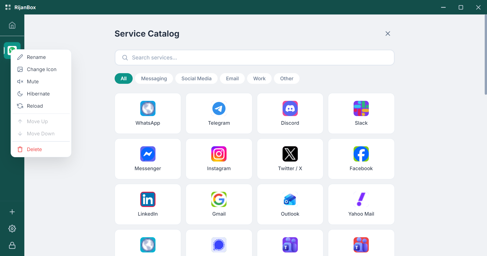
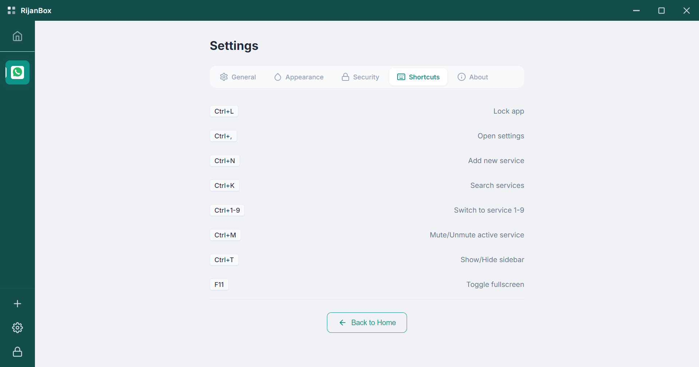

# RijanBox Complete Documentation (English)

Welcome to RijanBox! This application is designed to help you manage various web service accounts (such as WhatsApp, Gmail, Telegram) in one organized window.

---

## 1. Getting Started

After opening RijanBox, you will be greeted with an elegant Homescreen.

### Main Navigation
- **Sidebar**: Located on the left for quickly switching between services.
- **Home**: Displays your service statistics and quick access to popular services.
- **Catalog (+)**: Button to add new services.
- **Settings (Gear)**: To change application preferences.

---

## 2. Adding Services

To add a new service, click the **+** icon in the sidebar or the **Explore Catalog** button on the homescreen.

1. Find the service you want in the Catalog.
2. Click the service card to add it to the sidebar.
3. If the service is not listed, you can use the **Custom URL** feature at the bottom of the catalog.

---

## 3. Managing Services

Each added service can be managed by right-clicking its icon in the sidebar or homescreen.

Available features:
- **Rename**: Change the service display name.
- **Change Icon**: Use emojis or upload a custom image.
- **Mute**: Disable notifications for that service.
- **Hibernate**: Stop background processes to save RAM.
- **Delete**: Remove the service from RijanBox.

---

## 4. Settings & Appearance

RijanBox supports flexible themes to suit your mood.

- **Theme Mode**: Choose between Light, Dark, or Auto (follows system).
- **Color Theme**: 10 accent color choices (Blue, Teal, Green, etc.).
- **Language**: Available in Bahasa Indonesia and English.

---

## 5. PIN Security

Protect your privacy by enabling the PIN feature.

1. Go to **Settings > Security**.
2. Click **Enable PIN**.
3. Create a PIN between 4 and 8 digits.
4. You can also set **Auto-lock** if the app is not used for a certain period.

---

## 6. Keyboard Shortcuts

Use the keyboard for faster navigation.

| Shortcut | Action |
|----------|------|
| `Ctrl + L` | Lock App |
| `Ctrl + ,` | Open Settings |
| `Ctrl + N` | Add New Service |
| `Ctrl + K` | Search Services (Catalog) |
| `Ctrl + 1-9` | Switch to Service 1 to 9 |
